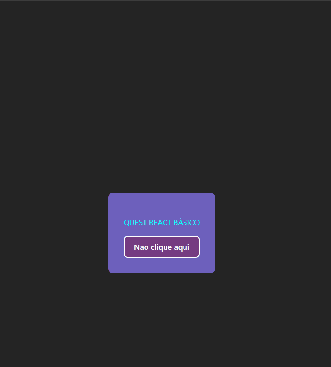

# Quest React Básico
Projeto desenvolvido no curso de Desenvolvimento Web Fullstack - DevQuest, utilizando conceitos básicos de React.  
O objetivo do projeto foi criar um componente que colore e transforma um texto para
maiúsculo e um componente Button com um evento de clique que
apresente um alerta informando a prop label do botão que
foi clicado.

## 🛠️ Tecnologias Utilizadas

  
  
  
  

